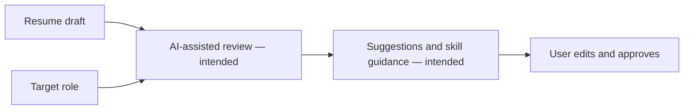
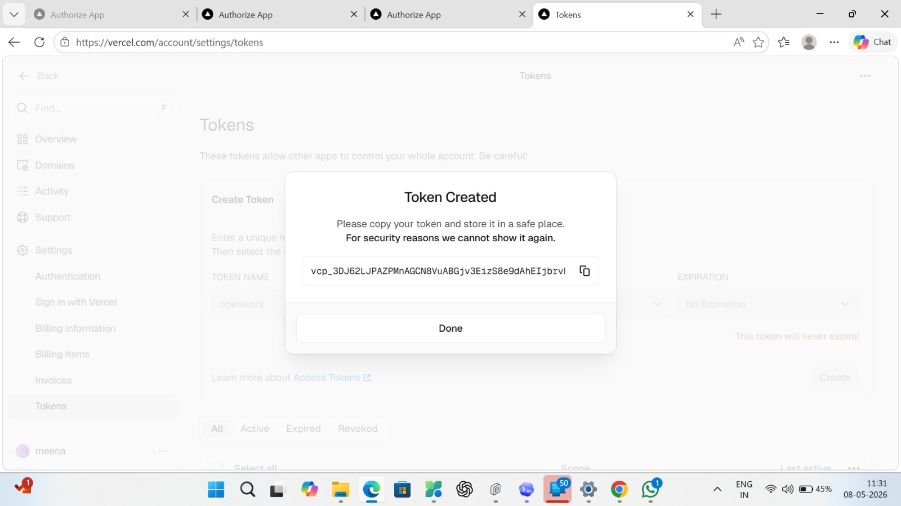
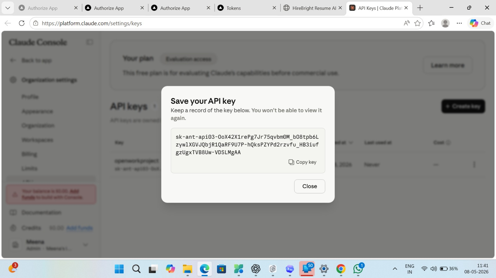
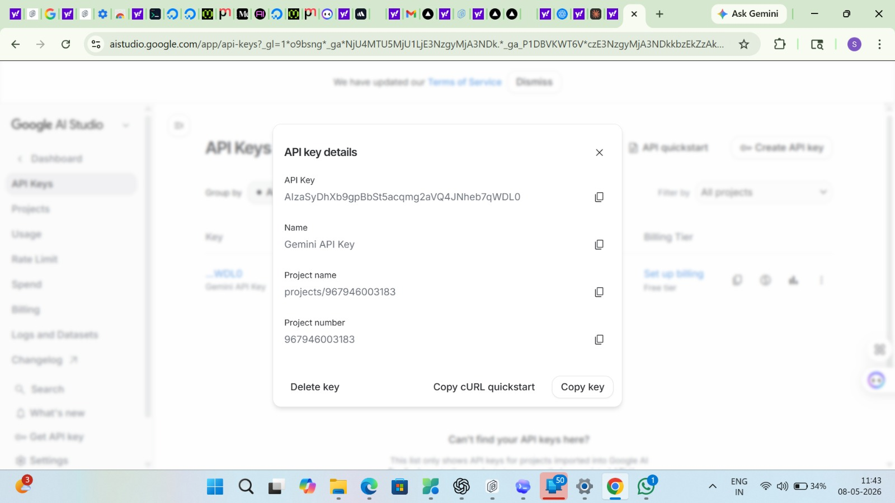

# GenAI Resume Assistant

<strong>A generative-AI resume-writing concept for improving clarity, tailoring content to a role, and surfacing skills to consider.</strong>

## Demo

The repository notes list [the hosted resume assistant](https://resume-assistant-seven.vercel.app/). Hosting status may change.

## Project overview

The repo contains project copy, screenshots, and a workflow image. The application source and build/deployment files are not tracked here, so this is a project showcase rather than a locally reproducible codebase.

## Intended workflow

The flow represents the intended user experience, not verified implementation details. AI-written content should be checked for factual accuracy and should not invent qualifications.

## Visuals

## Reproduce locally

Source code is not included in this repository. Add the application source, configuration, install steps, and model/provider details before presenting it as a reproducible project.
